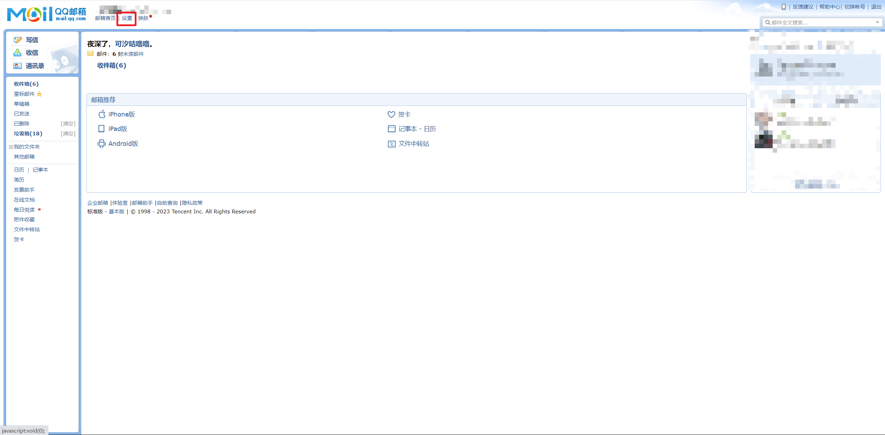
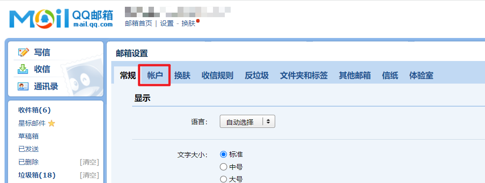
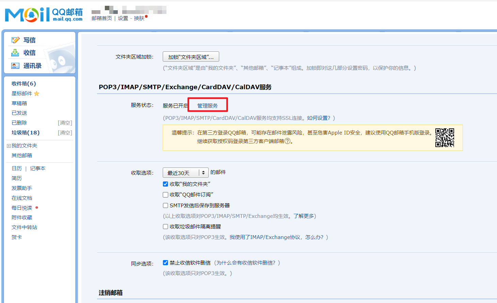
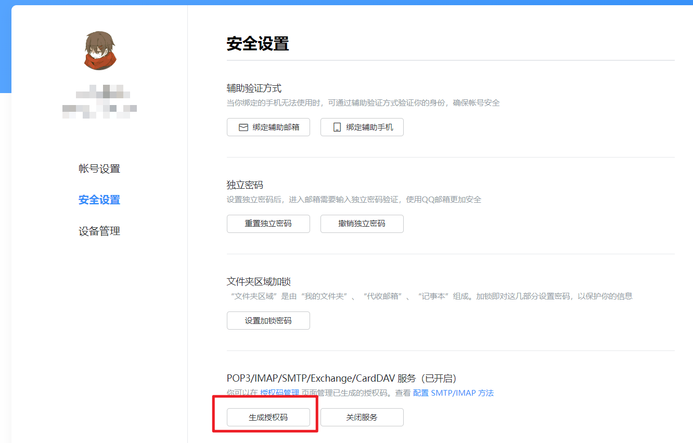
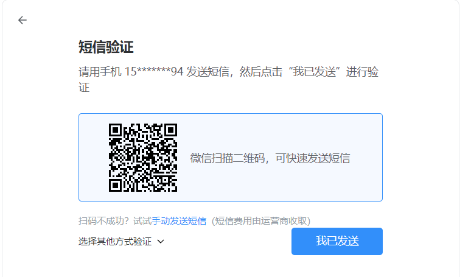
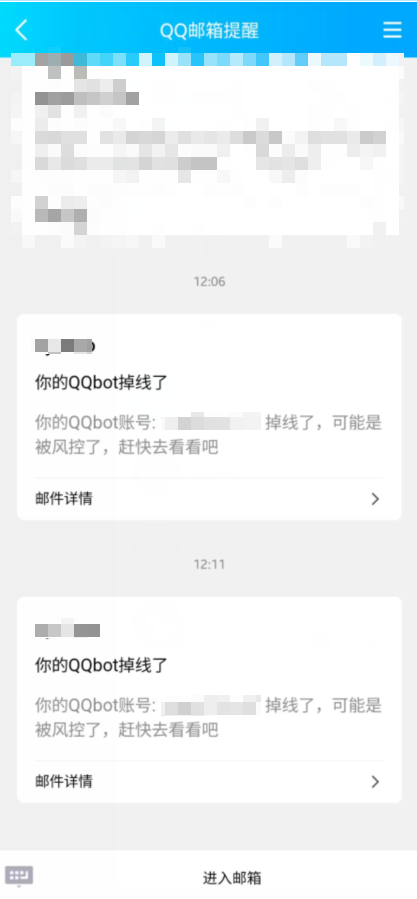

<div align="center">
  <a href="https://v2.nonebot.dev/store"></a>
  <br>
  <p></p>
</div>

<div align="center">

# nonebot-plugin-disconnect-notice

_✨ bot断连时的通知插件 ✨_


<a href="./LICENSE">
    
</a>
<a href="https://pypi.python.org/pypi/nonebot-plugin-disconnect-notice">
    
</a>


</div>


## 📖 介绍

- 可以在bot断开与nonebot的连接时向主人发送例如邮件的通知，用来通知主人bot可能被风控掉线
- 目前支持全部适配器协议，通知方式支持邮件通知
- 如果有其他通知方式的需求，欢迎提issues或pr

>断连事件是通过判断nb与bot端的ws连接状态来实现的，当主动停止nonebot框架时，会先断开ws连接，随后再退出,这意味着主动停止nonebot框架时，也会收到插件发送的离线通知消息，这个无法避免，属于正常情况

## 💿 安装

<details>
<summary>使用 nb-cli 安装</summary>
在 nonebot2 项目的根目录下打开命令行, 输入以下指令即可安装

    nb plugin install nonebot-plugin-disconnect-notice

</details>


<details>
<summary>使用包管理器安装</summary>
在 nonebot2 项目的插件目录下, 打开命令行, 根据你使用的包管理器, 输入相应的安装命令
<details>
<summary>pdm</summary>

    pdm add nonebot-plugin-disconnect-notice
</details>

<details>
<summary>poetry</summary>

    poetry add nonebot-plugin-disconnect-notice
</details>

</details>


## ⚙️ 配置
运行插件前，需要在 nonebot2 项目的`.env.prod`文件中添加下表中的smtp配置项
<details>
<summary>如果没有开启smtp看这里</summary>

- 以qq邮箱为例，其他邮箱的开启smtp方式是类似的

1.点击qq邮箱的设置


2.点击账户


3.点击管理服务，如果没有开启，这里可能显示的是`开启服务`


4.点击`生成授权码`


5.按照要求用密保手机号发送短信验证


6.复制得到的这个授权码


7.得到的这个`授权码`就相当于邮箱密码，邮箱账号就是qq邮箱，其他的一些常见邮箱的smtp_server和smtp_port配置参数参考下表

|   邮箱名    |   smtp_server   | smtp_port |   
|:--------:|:---------------:|:---------:|
|   qq邮箱   |   smtp.qq.com   |    465    |   
| 网易yeah邮箱 |  smtp.yeah.net  |    465    |
|  阿里云邮箱   | smtp.aliyun.com |    465    |
| 网易163邮箱  |  smtp.163.com   |    465    |
| 移动139邮箱  |  smtp.139.com   |    465    |


</details>


| 配置项 | 必填 | 值类型 | 默认值 | 说明 |
|:------:|:----:|:---:|:---:|:--:|
| disconnect_notice_smtp_user | 是 | str | ""  | 邮箱账号,如 114514@yeah.net |
| disconnect_notice_smtp_password | 是 | str | ""  | 邮箱密码或授权码,如 114514 |
| disconnect_notice_smtp_server | 是 | str | ""  | 邮箱服务器地址,如 smtp.yeah.net |
| disconnect_notice_smtp_port | 是 | int | 465  | 邮箱端口号，ssl模式时为465 |
| disconnect_notice_notice_email | 是 | str | ""  | 收件人邮箱，填写自己邮箱即可 |
| disconnect_notice_dev_mode | 否 | bool | False  | 开发者模式，该模式下bot断开连接不会触发通知消息，避免本地测试插件时不断重载而导致的大量掉线通知 |

<details>
<summary>示例配置</summary>
  
```env
# disconnect_notice示例配置
disconnect_notice_smtp_user = "114514@yeah.net" #邮箱账号
disconnect_notice_smtp_password = "114514" #邮箱密码
disconnect_notice_smtp_server = "smtp.yeah.net" #邮箱服务器地址
disconnect_notice_smtp_port = 465 #邮箱端口号
disconnect_notice_notice_email = "114514@qq.com" #收件人邮箱
disconnect_notice_dev_mode = False #开发者模式，该模式下bot断连不会触发通知消息，避免本地测试插件时不断重载而导致的大量掉线通知
```

</details>

## 🎉 使用
### 指令表
| 指令 | 权限 | 需要@ |  范围  |           说明            |
|:-----:|:----:|:----:|:----:|:-----------------------:|
| 断连通知测试 | 主人 | 否 | 所有会话 | 主动触发掉线通知测试，用来测试通知是否正常可用 |
### 效果图
<details>
<summary>邮件通知</summary>



</details>

## ✨喜欢的话就点个star✨吧，球球了QAQ


## ⏳ Star 趋势

[](https://starchart.cc/Cypas/nonebot_plugin_disconnect_notice)
