<div align="center">
  <a href="https://v2.nonebot.dev/store"></a>
  <br>
  <p></p>
</div>

<div align="center">

# nonebot-plugin-disconnect-notice

_✨ bot断连时的通知插件，支持多种通知方式 ✨_


<a href="./LICENSE">
    
</a>
<a href="https://pypi.python.org/pypi/nonebot-plugin-disconnect-notice">
    
</a>


</div>


## 📖 介绍

- 可以在bot断开与nonebot的连接时向主人发送微信公众号消息或邮件消息，用来通知主人bot可能被风控掉线
- 目前支持全部适配器协议，通知方式支持: [pushplus](https://www.pushplus.plus/)微信公众号通知; [server酱](https://sct.ftqq.com/r/1483)(方糖)微信公众号通知;[pushover](https://pushover.net/)安卓/ios/ipad/pc多设备通知; emil邮件通知
- 如果有其他通知方式的需求，欢迎提issues或pr

## 💿 安装

<details>
<summary>使用 nb-cli 安装</summary>
在 nonebot2 项目的根目录下打开命令行, 输入以下指令即可安装

    nb plugin install nonebot-plugin-disconnect-notice

</details>


<details>
<summary>使用包管理器安装</summary>
在 nonebot2 项目的插件目录下, 打开命令行, 根据你使用的包管理器, 输入相应的安装命令
<details>
<summary>pdm</summary>

    pdm add nonebot-plugin-disconnect-notice
</details>

<details>
<summary>poetry</summary>

    poetry add nonebot-plugin-disconnect-notice
</details>

</details>


## ⚙️ 配置
运行插件前，需要在 nonebot2 项目的`.env.prod`文件中按照不同推送方式添加下表中的相应配置项

<details>
<summary>server酱(方糖)公众号消息配置教程</summary>
> server酱每天免费消息推送额度只有5条

1. 进入[server酱官网](https://sct.ftqq.com/r/1483)
2. 点击网页右上角 **登录** 按钮，微信扫码完成登录
3. 回到网页端点击 **扫码后点此继续**  按钮
4. 点击sendkey下方的 **复制** 按钮，或者你可以新建单独的appkey，然后进行复制

   
5. 将token按照下方配置项名 disconnect_notice_server_key = "" 填入`.env.prod` 文件内

</details>

<details>
<summary>pushplus微信公众号消息配置教程</summary>

> pushplus现在强制要求实名以及每次实名1元认证费用，推荐使用其他推送配置

1. 进入[pushplus官网](https://www.pushplus.plus/)
2. 点击网页右上角 **登录** 按钮，微信扫码完成登录
3. 点击公众号提示的该卡片完成登录绑定，提示启用成功即可
   
   
4. 回到网页端，顶部菜单栏选择**发送消息 - 一对一消息**,然后点击**一键复制**
   
   
5. 将token按照下方配置项名 disconnect_notice_pushplus_token = "" 填入`.env.prod` 文件内

</details>

<details>
<summary>pushover消息配置教程</summary>

> pushover可通过他的安卓/ios/ipad/pc客户端进行推送，个人用户可免费使用30天，后续需要付费5美元买断，不太推荐此方式

1. 进入[pushplus官网](https://pushover.net/signup)并通过邮箱注册账号，并点开邮件内链接验证账号
2. 复制此处user_key
   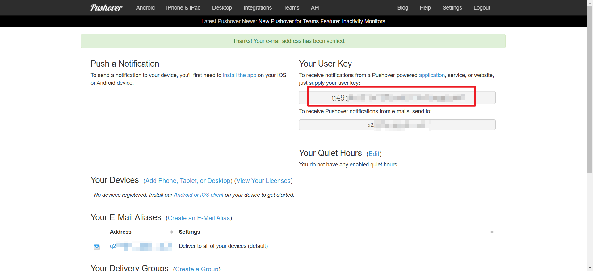
3. 网页向下滑动，点击创建app
   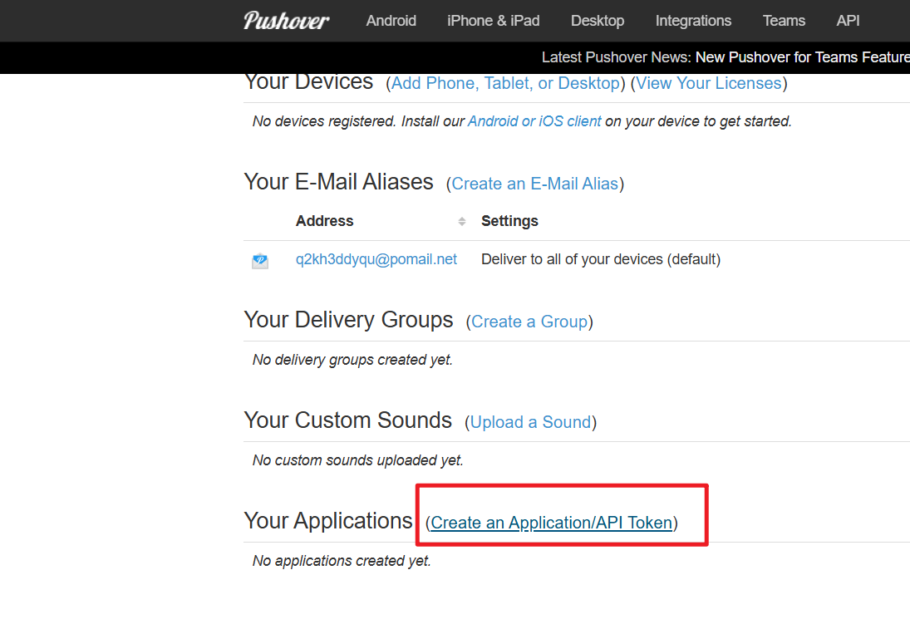
4. 输入一个app名称，如nb2，勾选条款后点击创建
   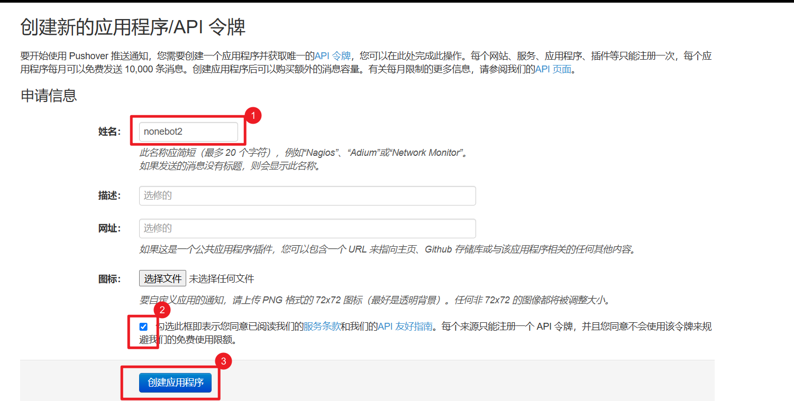
5. 复制此处token
   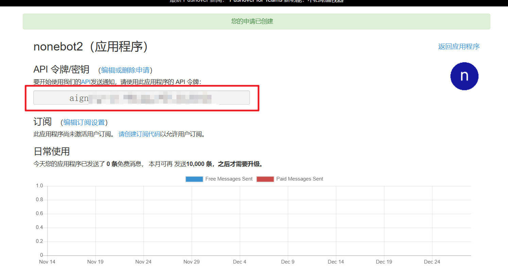

6. 将user_key和token按照下方配置项名 disconnect_notice_pushover_user_key = "",disconnect_notice_pushover_token = "" 填入`.env.prod` 文件内

7. 打开[pushover客户端下载页](https://pushover.net/clients)下载至少一个设备端的应用并登录相同账号 
   - ```注意```:ios端及mac端可以不用开启app的情况下进行消息推送，安卓端则需要保持google在线或app后台运行状态，这点对于安卓端相当不友好
   - ```注意```:每个设备端至多有30天试用期，到期后需要花费5美元买断(各设备端单独收费)

</details>

<details>
<summary>邮件通知配置教程</summary>

- 以qq邮箱为例，其他邮箱的开启smtp方式是类似的

1. 点击qq邮箱的设置
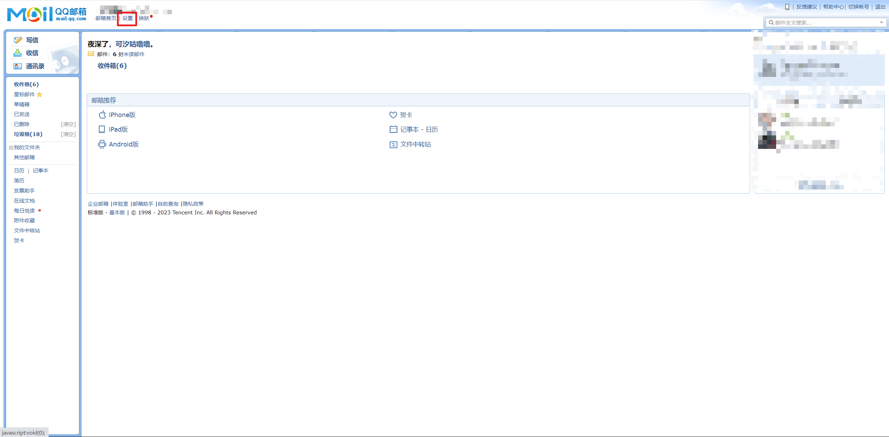

2. 点击账户


3. 点击管理服务，如果没有开启，这里可能显示的是`开启服务`
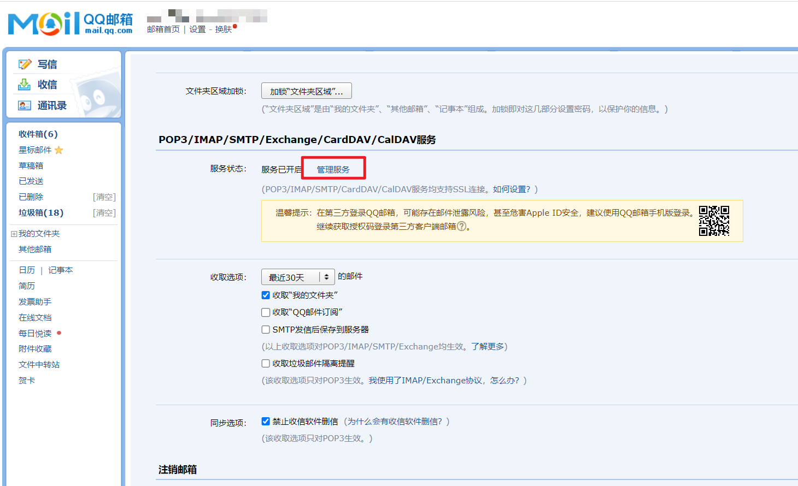

4. 点击`生成授权码`
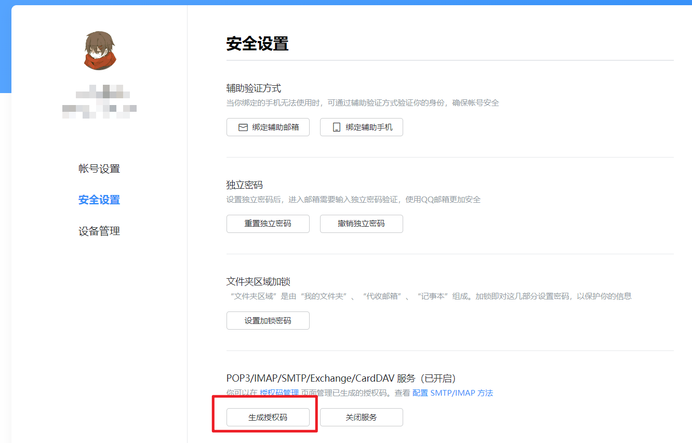

5. 按照要求用密保手机号发送短信验证
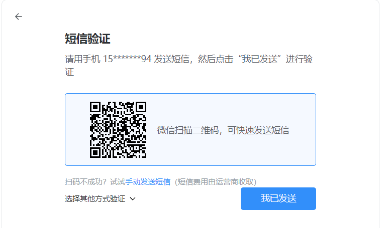

6. 复制得到的这个授权码
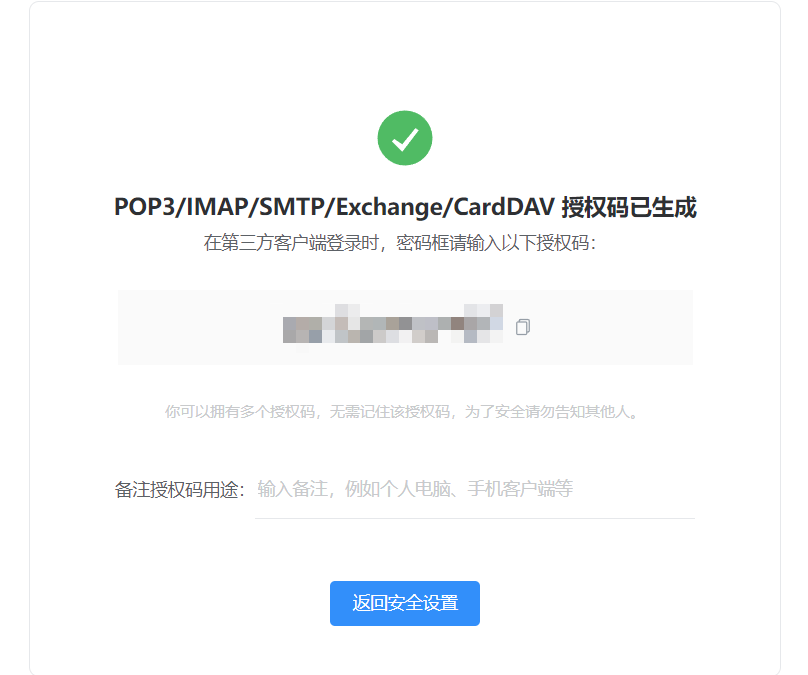

7. 得到的这个`授权码`就相当于邮箱密码，邮箱账号就是qq邮箱，其他的一些常见邮箱的smtp_server和smtp_port配置参数参考下表

|   邮箱名    |   smtp_server   | smtp_port |   
|:--------:|:---------------:|:---------:|
|   qq邮箱   |   smtp.qq.com   |    465    |   
| 网易yeah邮箱 |  smtp.yeah.net  |    465    |
|  阿里云邮箱   | smtp.aliyun.com |    465    |
| 网易163邮箱  |  smtp.163.com   |    465    |
| 移动139邮箱  |  smtp.139.com   |    465    |


</details>

|                 配置项                 | 必填 |    值类型    |    默认值     |                                  说明                                   |
|:-----------------------------------:|:--:|:---------:|:----------:|:---------------------------------------------------------------------:|
|     disconnect_notice_mode_list     | 是  | list[str] | ["server"] | 通知类型列表，枚举值: mail server pushplus pushover，可填写多个通知源，如["server"，"mail"] |
|  disconnect_notice_pushplus_token   | 是  |    str    |     ""     |                    pushplus微信公众号token，具体获取方式见上方教程                     |
|    disconnect_notice_server_key     | 是  |    str    |     ""     |                      server酱微信公众号key，具体获取方式见上方教程                      |
| disconnect_notice_pushover_user_key | 是  |    str    |     ""     |                     pushover user_key，具体获取方式见上方教程                     |
|  disconnect_notice_pushover_token   | 是  |    str    |     ""     |                      pushover token，具体获取方式见上方教程                       |
|     disconnect_notice_smtp_user     | 是  |    str    |     ""     |                        邮箱账号,如 114514@yeah.net                         |
|   disconnect_notice_smtp_password   | 是  |    str    |     ""     |                           邮箱密码或授权码,如 114514                           |
|    disconnect_notice_smtp_server    | 是  |    str    |     ""     |                        邮箱服务器地址,如 smtp.yeah.net                        |
|     disconnect_notice_smtp_port     | 是  |    int    |    465     |                           邮箱端口号，ssl模式时为465                            |
|   disconnect_notice_notice_email    | 是  |    str    |     ""     |                            收件人邮箱，填写自己邮箱即可                             |
|     disconnect_notice_dev_mode      | 否  |   bool    |   False    |           开发者模式，该模式下bot断开连接不会触发通知消息，避免本地测试插件时不断重载而导致的大量掉线通知           |
|  disconnect_notice_max_grace_time   | 否  |    int    |     10     |                断连后最大宽限时长，单位:秒，如果在此期间bot完成了重连，则不触发邮件通知                 |

<details>
<summary>示例配置</summary>
  
```env
## disconnect_notice掉线通知示例配置
# 通知方式list，可填写多种通知方式 枚举值:pushplus mail server
disconnect_notice_mode_list = ["pushplus"]
# pushplus微信公众号通知 https://www.pushplus.plus/
disconnect_notice_pushplus_token = ""
# server酱 https://sct.ftqq.com/r/1483
disconnect_notice_server_key = ""
# pushover
disconnect_notice_pushover_user_key = ""
disconnect_notice_pushover_token = ""
# 邮件通知
disconnect_notice_smtp_user = "114514@yeah.net" #邮箱账号
disconnect_notice_smtp_password = "114514" #邮箱密码
disconnect_notice_smtp_server = "smtp.yeah.net" #邮箱服务器地址
disconnect_notice_smtp_port = 465 #邮箱端口号
disconnect_notice_notice_email = "114514@qq.com" #收件人邮箱
# 其他设定
disconnect_notice_dev_mode = False #开发者模式，该模式下bot断连不会触发通知消息，避免本地测试插件时不断重载而导致的大量掉线通知
disconnect_notice_max_grace_time = 10 #断连后最大宽限时长，单位:秒，如果在此期间bot完成了重连，则不触发邮件通知
```

</details>

## 🎉 使用
### 指令表
|  指令   | 权限 | 需要@ |  范围  |           说明            |
|:-----:|:----:|:----:|:----:|:-----------------------:|
| /掉线测试 | 主人 | 否 | 所有会话 | 主动触发掉线通知测试，用来测试通知是否正常可用 |
### 效果图
<details>
<summary>邮件通知</summary>

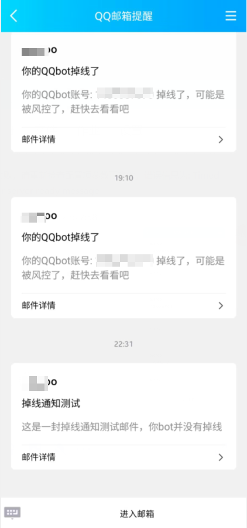

</details>

<details>
<summary>pushplus微信通知</summary>


</details>

<details>
<summary>server酱微信通知</summary>

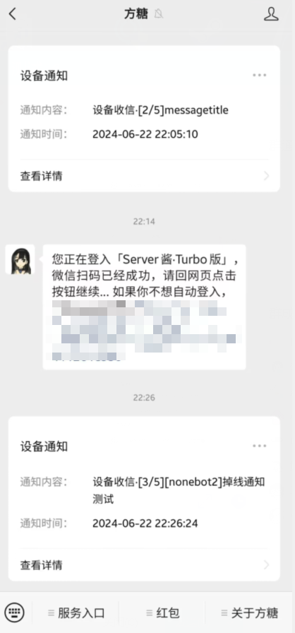

</details>

<details>
<summary>pushover通知</summary>

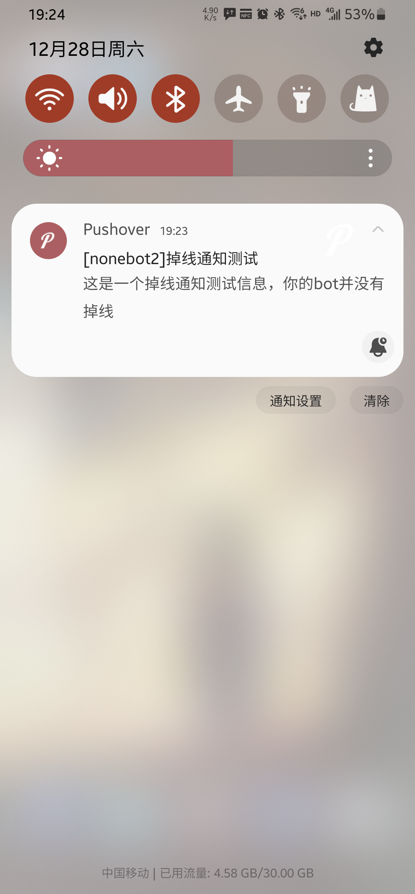
</details>

## ✨喜欢的话就点个star✨吧，球球了QAQ


## ⏳ Star 趋势

[](https://starchart.cc/Cypas/nonebot_plugin_disconnect_notice)
